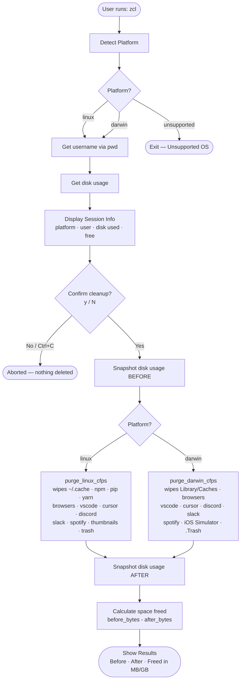

# ZCL — Z Cleaner

A cross-platform cache cleaner built for 42 School students.
One script, two platforms, no setup headaches.

---

## Table of Contents

- [Short Description](#short-description)
- [How to Install](#how-to-install)
- [How it Works](#how-it-works)
- [Contribute](#contribute)

---

## Short Description

| Key           | Value                                                                 |
|---------------|-----------------------------------------------------------------------|
| Name          | ZCL — Z Cleaner                                                       |
| Description   | A session cache cleaner for 42 students on shared machines            |
| Version       | 2.0 — Python rewrite, successor to `zcleaner` written in C           |
| Language      | Python 3 + GNU Make                                                   |
| Platforms     | Linux · macOS (Darwin)                                                |
| Origin        | Migrated from private repo `zcl-internal`, now public                |
| Target Users  | 42 School students dealing with session storage limits                |
| Why it exists | Cache files from browsers, editors, and package managers pile up silently and eat your session quota. ZCL clears all of it in one command. |

---

## How to Install

### Prerequisites

You need Python 3 on your machine and at least one of these shell configs: `.bashrc`, `.zshrc`, `.profile`, or fish's `config.fish`.

### Steps

Clone the repository and move into it:

```bash
git clone https://github.com/your-username/zcl.git
cd zcl
```

Run the installer:

```bash
make install
```

The installer handles everything — it detects your shell config, finds your Python interpreter, copies the project files to `~/.zcl/`, and registers the `zcl` alias so you can call it from anywhere.

Once it's done, reload your shell:

```bash
source ~/.zshrc   # or ~/.bashrc, depending on what you use
```

That's it. From now on, just run:

```bash
zcl
```

---

### Uninstall

```bash
make uninstall
```

This removes the `~/.zcl/` directory and strips the `zcl` alias from all detected shell configs. Restart your terminal afterward and it will be like it was never there.

---

### Makefile Targets

| Target            | Description                                  |
|-------------------|----------------------------------------------|
| `make install`    | Install ZCL and register the `zcl` command   |
| `make uninstall`  | Remove ZCL and clean all shell aliases       |
| `make clean`      | Remove local `__pycache__` and `.pyc` files  |

---

## How it Works

### Execution Flow Diagram

*(Place your diagram screenshot here)*



---

### What Gets Cleaned

ZCL splits its work into two modules, one per platform.

**Linux** — `zcl_linux_machine_cfps.py`

Covers the general system cache under `~/.cache`, then goes through package managers like npm, pip, yarn, cargo, gem, and bun. It also handles editors — VS Code and Cursor — cleaning their cache folders, workspace storage, and crashpad data. On the browser side it targets Chrome, Brave, Firefox, Opera, and Vivaldi, both native installs and Flatpak versions. Apps like Discord, Slack, Spotify, GitKraken, Obsidian, and Docker are included as well. Finally it clears thumbnails, the Trash, and a handful of 42-specific files like `.42*` and `.zcompdump*`.

**macOS** — `zcl_darwin_machine_cfps.py`

Starts with `~/Library/Caches`, then covers the same editors and browsers as the Linux module but using their macOS paths. It also handles Docker, Spotify, and the iOS Simulator (`CoreSimulator`). On top of that it cleans `.Trash`, `Downloads`, and 42-specific leftovers like `Piscine Rules *.mp4` and `PLAY_ME.webloc` that tend to show up on school machines.

---

### Project Structure

```
zcl.py                        Entry point — detects platform, runs the session, shows results
zcl_linux_machine_cfps.py     Linux cache path list and purge logic
zcl_darwin_machine_cfps.py    macOS cache path list and purge logic
makefile                      install / uninstall / clean targets
cache_dirs/
  linux_machine.cfp           Linux cache path config file
  darwin_machine.cfp          macOS cache path config file
```

---

## Contribute

ZCL started as an internal tool to solve a real problem at 42, and it can keep getting better. If you use it and want to help, here are a few ways to do that.

The most useful contributions are usually new cache paths — if you notice something that ZCL misses on your machine, you can add it directly to `zcl_linux_machine_cfps.py` or `zcl_darwin_machine_cfps.py`. Bug reports are equally welcome, especially if something breaks on a specific machine setup. If you want to go further, the installer could use better edge-case handling, and fish shell support still has room for improvement.

To send a contribution:

```bash
# Fork the repo, then:
git checkout -b feat/your-feature-name

# Make your changes, test them, then:
git commit -m "feat: describe what you changed"
git push origin feat/your-feature-name
# Open a Pull Request
```

ZCL is the Python successor to the original `zcleaner` tool written in C. If you went through 42 you already know why this tool exists — help make it better.

---

Made for the 42 Network.
